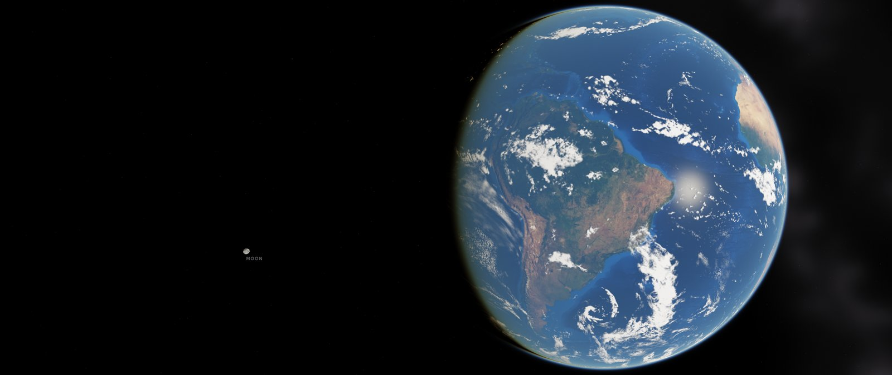
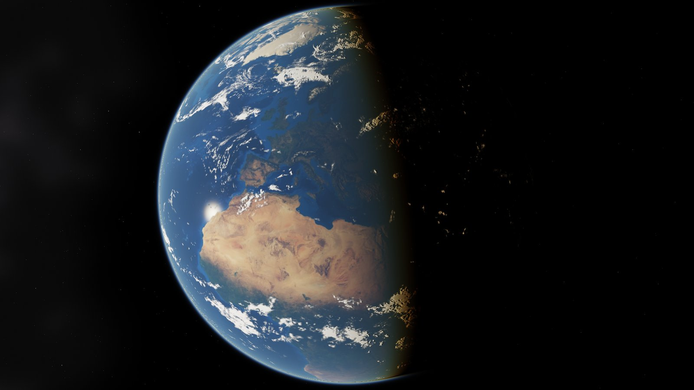
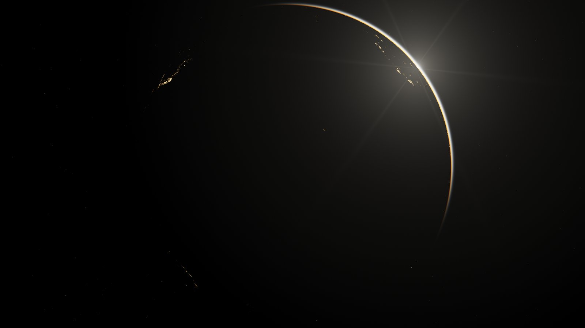

# 3D Earth — live wallpaper for Windows 10/11

A real-time 3D Earth that lives **on your desktop, behind the icons and the taskbar**:

- **Current clouds** from geostationary weather satellites, refreshed every hour and cross-faded in slowly, drawn as a layered 3D cloud deck. Procedural billows add detail from continent scale down to a few km, with relief lighting and self-shadowing
- **Active hurricanes, typhoons and cyclones** with name, category and wind speed (NHC + GDACS)
- **True day and night**: the Sun's real position, with city lights, a sunset-coloured terminator, ocean glint and atmospheric haze
- **The Moon and planets at their real positions and true sizes**, with the correct lunar phase, over 5,000 real stars and the Milky Way
- The Earth always **fills the screen height** on any monitor shape (16:9, ultrawide, portrait, multi-monitor)

| Moon beside the Earth (ultrawide) | Above my location | Sunrise behind the Earth |
|---|---|---|
|  |  |  |

*(Previews are software-rendered with the bundled offline textures. On a real PC the app downloads 8K textures and the live cloud map.)*

## Install

1. Download `3DEarth-Setup-x.y.z.exe` from the [latest release](https://github.com/vagdesign/3D-Earth/releases/latest).
2. Run it. Administrator rights are not needed; it installs per user. Leave **"Start 3D Earth automatically when I sign in"** ticked to have it start with Windows.
3. The Earth replaces your desktop background immediately. A globe icon appears in the notification area.

Requirements: Windows 10 1809+ or Windows 11, x64, and the Microsoft Edge **WebView2 Runtime**. The runtime is already present on almost every PC; the installer and the app offer the download link if it is missing.

A portable `.zip` is also built. Unzip it anywhere and run `3DEarth.exe`.

## Using it

Right-click the globe in the notification area:

| Menu | What it does |
|---|---|
| **View → Moon beside the Earth** | A real vantage point from which the Moon sits in the empty space beside the Earth. North is kept as close to up as possible. |
| **View → Above my location** | Hovers above your home location, like a geostationary satellite. Day and night sweep across it. |
| **View → Sunrise behind the Earth** | The Sun just behind the limb: glowing atmosphere, night side with city lights. |
| **Explore (full screen)** | The same live scene, interactive, on top of everything. Press Esc to go back. |
| Open in a window | The interactive scene in a normal window. |
| Moon / planet labels, Storm labels | Toggle the small text labels. |
| Update weather now | Downloads the newest cloud map and storm list. |
| **Motion** | *Real time*, *Spin 360° from my location* (one turn per minute by default), *Time-lapse*, or *Day & night time-lapse above my location*. During a time-lapse the clouds of the last 24 hours are replayed in a loop, in step with day and night. The app keeps every cloud map it downloads for 24 h, so the loop fills in over the first day. The speed and a specific date/time are in Settings. |
| Pause | Stops rendering, which uses 0% GPU. |
| Start with Windows | Adds or removes the per-user autostart entry. |
| **Settings…** | Tabs for view, surface (land brightness, ocean reflection and roughness, haze), motion and time, weather, sky and performance. Includes location, Earth size and position, Moon size (true size up to 4×), clouds, stars, brightness, quality, frame rate, monitors, power saving, update interval, custom cloud-map URL. |

### Interactive controls (Explore / window)

| Input | Action |
|---|---|
| Drag with the left mouse button | Rotate freely around the Earth |
| W A S D or the arrow keys | Pan |
| + / −, Page Up / Page Down, mouse wheel | Zoom in / out |
| R, Home or double-click | Reset the view |
| H, ? or F1 | Show or hide this help |
| Esc | Close Explore |

The wallpaper itself does not react to the mouse, because Windows sends desktop clicks to the icons. Use Explore for that.

To change the static picture Windows shows when 3D Earth is not running, use the normal **Settings → Personalization → Background** page. 3D Earth draws on top of that background and below the icons, and restores it when you exit.

Power saving (on by default): rendering pauses when a maximised or full-screen app covers a monitor, while the PC is locked, and on battery.

## How it works

```
3DEarth.exe (C# / WinForms, .NET 10)
 ├─ DesktopLayer      finds the desktop layer between the wallpaper and the icons
 │                    (WorkerW on Windows 10/11, Progman child on Windows 11 24H2+)
 ├─ WallpaperWindow   one borderless window per monitor, parented into that layer,
 │                    hosting WebView2; serves ./web and the data folder from one origin
 ├─ DataService       downloads clouds, storms and HD textures to %LOCALAPPDATA%\3D Earth\data
 └─ TrayContext       tray menu, settings, watchdog (Explorer restarts, display changes), power saving

web/ (Three.js WebGL scene; runs in any browser too)
 ├─ astro.js      Sun/Moon/planet positions and Earth rotation (Astronomy Engine)
 ├─ framing.js    keeps the Earth filling the screen height; the three camera views
 ├─ shaders.js    analytic atmospheric scattering (Rayleigh + Mie), clouds, ocean glint
 ├─ earth.js      surface, cloud shell with cloud shadows, atmosphere halo
 ├─ moon.js       Moon (Lommel-Seeliger shading, tidally locked)
 └─ sky.js        stars (Yale BSC), Milky Way, planets, Sun and lens glare
```

Everything is in its real place. The scene uses the Earth's real rotation (sidereal time), the Sun direction for this moment, the Moon's real distance of about 60 Earth radii and its true size, and the planets' true directions. Only the camera position is chosen, and it is always a physically possible viewpoint.

### Data sources

| Data | Source | Refresh |
|---|---|---|
| Global cloud map | [Live cloud maps](https://github.com/matteason/live-cloud-maps) by Matt Eason, from EUMETSAT/NOAA/JMA geostationary imagery | every 60 min (configurable) |
| Tropical cyclones | [NOAA National Hurricane Center](https://www.nhc.noaa.gov/) `CurrentStorms.json` and [GDACS](https://www.gdacs.org/) | same |
| Earth surface (choose in Settings → Surface) | [Solar System Scope](https://www.solarsystemscope.com/textures/) 8K (CC BY 4.0), [NASA Blue Marble Next Generation](https://visibleearth.nasa.gov/collection/1484/blue-marble) for the current month (seasons; 21600 px scaled to 8K), [Natural Earth III](https://www.shadedrelief.com/natural3/) 8K shaded relief, or the built-in 4K | once per choice |
| Night lights, Moon | Solar System Scope (CC BY 4.0) | once |
| Offline textures (bundled) | NASA Blue Marble / Earth at Night (public domain), via three-globe examples | — |
| Milky Way | [ESO/S. Brunier panorama](https://www.eso.org/public/images/eso0932a/) (CC BY 4.0), mapped from galactic coordinates | — |
| Stars | [d3-celestial](https://github.com/ofrohn/d3-celestial) data (Yale Bright Star Catalogue) | — |

You can set your own cloud source in **Settings → Cloud map URL**. It must be an equirectangular (2:1) image with white clouds on black.

## Development

Preview the scene in a browser (no Windows needed):

```bash
npm run serve        # then open http://localhost:8080/?debug
```

Query parameters override any setting and the clock, for example
`?view=home&homeLat=40.6&homeLon=22.9&t=2026-09-25T18:00:00Z&timeSpeed=600`.

Headless previews (as in CI): `npm install --no-save playwright && node tools/screenshot.mjs previews "view=moon"`.

Build the Windows app (on Windows, with the .NET 10 SDK):

```powershell
dotnet publish src/ThreeDEarth/ThreeDEarth.csproj -c Release -r win-x64 --self-contained -o publish
& "${env:ProgramFiles(x86)}\Inno Setup 6\ISCC.exe" /DSourceDir=..\publish installer\3DEarth.iss
```

GitHub Actions builds the installer and the portable zip on every push. Pushing a tag `vX.Y.Z` creates a release.

Logs are written to `%LOCALAPPDATA%\3D Earth\3DEarth.log`. Start with `--devtools` to be able to inspect the page.

## Credits

Created by **Vangelis Makridakis** ([Ax-Easy](https://www.ax-easy.com)) and **[Claude](https://claude.ai)** (Anthropic).
A small credits line is shown bottom-right. It can be turned off in Settings → Sky.

Third-party components and data: see [THIRD_PARTY_NOTICES.md](THIRD_PARTY_NOTICES.md).
